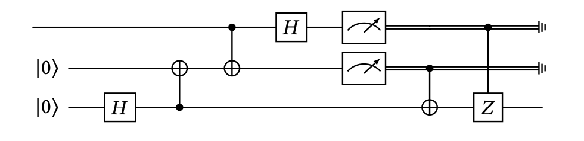

# Getting started

QuRA is used to analyze the resource consumption of quantum algorithms described in the PQ language.
The purpose of this guide is to help new users get started with the tool and to introduce them to the syntax and types of PQ.
As a running example, we'll use the following PQ implementation of [quantum teleportation](https://en.wikipedia.org/wiki/Quantum_teleportation):

```hs
-8<-
docs/snippets/teleportation.pq:3
-8<-
```

The syntax of PQ is designed to look like [Haskell](https://www.haskell.org), and in particular like the [Quipper](https://www.mathstat.dal.ca/~selinger/quipper/) EDSL, so programmers experienced with either language should feel at home. For a detailed description of PQ, refer to [the relevant documentation](../language/overview.md). For now, we only focus on the key aspects of the language:

- A line like `bell :: !((Qubit, Qubit) -o (Qubit, Qubit))` is a type signature: it declares a function named `bell` and tells us that it takes as input two qubits and outputs two qubits. By default, PQ functions are linear, as denoted by the `-o` (linear arrow) type. A top-level function signature must be followed by a function definition of the same name, e.g. `bell (q, p) = ...`.
- The `!` (bang) at the beginning of the type tells us that the `bell` function is in actually nonlinear, and as such can be used many times. Top-level definitions are nonlinear by default, whereas arbitrary expressions can be marked as duplicable via the `lift` operator (not shown in this example). Conversely, in order to use a duplicable function or expression, we must first `force` it, like in `force hadamard`.
- The language comes equipped with library functions that correspond to common quantum operations, like the initialization of a qubit (`qinit0`), the discarding of a bit(`cdiscard`), measurement (`meas`) and several quantum gates (`hadamard`, `cnot`, `ccnot` and `ccz`).
- The argument `@0` appears in many places in the program. The `@` symbol prefixes a special class of arguments called *index parameters*, which will play a significant role [later on](#local-metric-analysis) when we start analyzing local resource metrics. For now, we can set all these parameters to 0 and ignore them.

## Type checking

We can typecheck the teleportation program by passing it to QuRA, without any additional arguments:
```txt
$ qura teleportation.pq
Analyzing file 'teleportation.pq'.
Checked type.

bell :: !((Qubit, Qubit) -o (Qubit, Qubit))

alice :: !((Qubit, Qubit) -o (Bit, Bit))

bob :: !((Qubit, Bit, Bit) -o Qubit)

teleport :: !(Qubit -o Qubit)
```

QuRA successfully checked all the top-level definitions in `teleportation.pq` against their type signatures, and returned the latter. Note that QuRA is also capable of *inferring* the type signature of top-level definitions, provided they are in the form `<name> = <expression>` (i.e. they don't have formal parameters). In this guide, however, we stick to explicit signatures.

## Circuit size analysis

Type checking by itself is nice, but we are more interested in the *resource requirements* of PQ programs. Most quantum programming languages, including PQ, either produce or are compiled into *quantum circuits*. A circuit is a low-level representation of the quantum core of the computation, which *must* run on quantum hardware.
The `teleport` function, for example, produces a circuit that looks like this:



The size and shape of such a circuit determines whether it can be executed successfully by a given quantum architecture. For example, a circuit might be too *wide* (i.e. act on too many wires), and exceed the number of qubits in the architecture, or too *deep* (i.e. require many sequential operations), and exceed its coherence time. Furthermore, some architectures may deal poorly with a particular set of gates, or a specific wire type. All in all, keeping track of metrics such as circuit width or depth in a flexible and extensible manner is particularly desirable.

QuRA lets us to specify upper bounds on the size of the circuits built by programs by directly annotating their type. Let's revisit the teleportation example, focusing on circuit width. The circuit shown above has a width of 3, so we can annotate the type signature of `teleport` and its auxiliary functions accordingly:

```hs
-8<-
docs/snippets/teleportation-width.pq:3
-8<-
```

The signature `teleport :: !(Qubit -o Qubit)` has become `teleport :: `, with the addition of three type annotations. In order of importance:

- The 3 in `-o[3,0]` is the *effect annotation* of the function. It tells us that `teleport` produces a circuit of width *at most* 3 when applied.
- The 0 in `-o[3,0]` is the *closure annotation* of the function. It tells us that the data captured in the function's closure has a width of 0. This piece of information might seem exotic at first, but it is essential: in a language with first-class functions, a closure may very well capture variables with non-negligible size, such as qubits and bits. When that happens, the closure itself has a size, which must be recorded in order for the overall analysis to be sound. In our case, the `teleport` function is defined at the top level, so it cannot capture anything from the surrounding environment, let alone a qubit.
- The 0 in `![0]` tells us that `force`ing `teleport` produces a circuit of width 0. In other words, it tells us that no circuit is produced as a side-effect of forcing `teleport`.

The other signatures in the program are annotated in a similar way. Together, they tell us that `bell` and `alice` produce circuits of width at most 2, while `bob` and `teleport` produce circuits of width at most 3. By running QuRA with the `-g width` option, we can check that these upper bounds actually hold:
```txt
$ qura teleportation-width.pq -g width
Analyzing file 'teleportation-width.pq'.
Checked type, width.

...

teleport :: 
```

Note that by replacing `-g width` with `-g gatecount` we can verify the gate count of `teleport`, instead of its width. If we run this analysis on the same source code, however, we get the following error:
```txt
$ qura teleportation-width.pq -g gatecount
* Expected expression 'alice'
   to have type
    ' -o[2, 0] (Bit, Bit))',
   got
    ' -o[4, 0] (Bit, Bit))'
   instead
```

This is because we are asking QuRA to verify that the circuit described by `alice` is made of at most 2 gates, which is simply untrue, as `alice` produces a 4-gate circuit (note that measurements count as gates). Luckily, QuRA is able to infer this and it suggests that `alice` should have type ` -o[4, 0] (Bit, Bit))`.
If we fix this and the remaining function signatures, we can verify the following gate counts for the teleportation functions:
```txt
$ qura teleportation-gatecount.pq -g gatecount
Analyzing file 'teleportation-gatecount.pq'.
Checked type, gate count.

bell ::  -o[2, 0] (Qubit, Qubit))

alice ::  -o[4, 0] (Bit, Bit))

bob ::  -o[2, 0] Qubit)

teleport :: 
```

## Local metric analysis

In the previous examples, we used QuRA to verify the size of a circuit according to varying definitions of size. We call size metrics such as width and gate count *global resource metrics*, since they are properties of a circuit *as a whole*.

QuRA also lets us to verify properties of the individual wires within the circuit, that is, of the individual qubits and bits involved in the program. We call these properties *local resource metrics*. Depth is one such property, defined as the minimum number of execution steps required to produce a qubit, assuming that independent gates can be applied concurrently.

In order to specify an upper bound to the depth of the bits and qubits involved in the teleportation example, we no longer annotate arrow and bang types, but rather the wire types `Qubit` and `Bit` themselves, like this:

```hs
-8<-
docs/snippets/teleportation-depth.pq:3
-8<-
```

Local metric annotations are enclosed in curly braces, as opposed to square brackets, to better distinguish them from global metric annotations. You can see that the signature `teleport :: !(Qubit -o Qubit)` has become `teleport :: !(Qubit{0} -o Qubit{6})`, meaning that `teleport` takes as input a qubit at depth 0 and outputs a qubit at depth 6.

By invoking QuRA with the `-l depth` option, we can check that these upper bound is sound:
```txt
$ qura teleportation-depth.pq -l depth
Analyzing file 'teleportation-depth.pq'.
Checked type, depth.

...

teleport :: !(Qubit{0} -o Qubit{6})
```

Note that we now care about what index parameters we pass to library functions. These parameters specify the maximum depth at which the function can expect to find its qubit and bit arguments. This form of "local metric polymorphism" is essential, as it allows us to apply library operations to any qubit or bit, regardless of its depth.
For example, `force hadamard @3` in the definition of `alice` can be applied succesfully to qubit `r` because the latter is at depth `3`. If we changed `force hadamard @3` to `force hadamard @2`, for instance, we would encounter the following error:

```txt
$ qura teleportation-depth.pq -l depth
* Expected expression 'r'
   to have type
    'Qubit{2}',
   got
    'Qubit{3}'
   instead
   ...
```

## Dependent types

Naturally, local metric polymorphism is not only important for library functions. In fact, it would be good if our definition of `teleport` could also be applied to qubits at any depth. As it is currently defined, `teleport` can only be applied to inputs of type `Qubit{0}`, that is, to freshly initialized qubits. What if we needed to teleport a qubit after applying some operations to it? Tough luck! We'd have to write a new `teleport` which accepts qubits at the required depth.

In order to avoid this duplication, we can make `teleport` parametric in the depth of its input qubit. We do so by extending its definition with a new index parameter `dr`, which represents the maximum depth of the qubit `r` that we're teleporting:

```hs
-8<-
docs/snippets/teleportation-depth-generic.pq:3
-8<-
```

Note that we extended the remaining function definitions in a similar way, introducing a new depth parameter for each qubit or bit input. The signature `teleport :: !(forall dr. Qubit{dr} -o Qubit{dr+6})` tells us something more general than `teleport :: !(Qubit{0} -o Qubit{6})`: it tells us that *for all* `dr`, `teleport` takes as input a qubit at depth `dr` and outputs a qubit at depth `dr+6`. We call `forall dr. Qubit{dr} -o Qubit{dr+6}` a *dependent type*, since its precise meaning *depends* on the function parameter `dr`. Once again, QuRA can verify that the signature we gave for `teleport` actually holds:

```txt
qura teleportation-depth-generic.pq -l depth
Analyzing file 'teleportation-depth-generic.pq'.
Checked type, depth.

...

teleport :: !(forall dr. Qubit{dr} -o Qubit{dr + 6})
```

## Circuit families

Dependent types are not only useful in local metric analysis. They become essential when describing and analyzing more complex quantum programs, which don't necessarily correspond to a *single* circuit.
The `teleport` function that we've seen so far always describes the same circuit, regardless of the value of `dr`. *Verifying* the size of such a circuit offers no real advantage: we could have simply applied teleport to any input, checked the resulting circuit, and directly computed its width, gate count, and depth instead of analyzing the source code.

Verification becomes essential when a PQ function describes a *family* of circuits, that is, different circuits depending on its input parameters. This is actually the case for most quantum programs, since quantum algorithms usually accept inputs of varying size and shape (e.g. quantum registers of any number of qubits), and one individual circuit isn't enough to deal with all of them.
In this case, running the function on an arbitrary input and checking the size of the resulting circuit doesn't really tell us anything about the resource requirements of the program, but rather of *only one run* of the program.

An ubiquitous example of a quantum algorithm that corresponds to a circuit family is the quantum Fourier transform (QFT), which can be implemented in PQ as follows:

```hs
-8<-
docs/snippets/qft.pq:3
-8<-
```

The signature `qft :: !(forall n. List[i<n] Qubit -o List[i<n] Qubit)` tells us that `qft` is a function that, *for all n*, takes as input a list of `n` qubits and outputs a list of the same length.
In this signature we encounter a new kind of annotated type, the *sized dependent list type*. A type like `List[i<n] Qubit` represents a list of *exactly* `n` qubits. The elements of the list may have a type that depends on `i`, which ranges from 0 (included) to `n` (excluded) and represents the position of the element within the list. In this case, `Qubit` doesn't depend on `i`, but dependency is useful when we are working with nested lists or resource-annotated types. For example, `List[i<n] List[j<i] Qubit` is a list of `n` lists of qubits, where the `i`-th list has length `i`. Similarly, `List[i<n] Qubit{i}` is a list of `n` qubits where the `i`-th qubit sits at depth `i`.

Notice that whereas the index parameters that we've encountered in the teleportation examples are only used for verification, and thus are ignored at runtime, the `n` parameter in the definition of `qft` has a profound impact on the circuit described by the function: `qft @1` accepts an input of type `List[i<1] Qubit`, and thus corresponds to a circuit with only one input. `qft @2` is a circuit with 2 inputs, while `qft @10` a circuit with 10 inputs, and so on.

Naturally, any form of size or depth analysis of `qft` must take `n` into account, and reasonably produce upper bounds on the size of the circuit that are parametric in `n`. For example, we can verify the width of `qft` as follows:

```hs
-8<-
docs/snippets/qft-width.pq:3
-8<-
```

The signature `qft :: !(forall n. List[i<n] Qubit -o List[i<n] Qubit)` becomes `qft :: `, telling us that, for all `n`, `qft` takes as input a list of `n` qubits and outputs a list of `n` qubits, describing a circuit of width at most `n`.

Note that the `forall[0,0]` type is annotated the same way as the linear arrow `-o`. This is because, at the fundamental level, both represent functions: whereas `a -o b` represents a linear function from values of type `a` to values of type `b`, the type `forall i. c` represents a function from indices to values of type `c`. The only real difference is that `c` is allowed to depend on the `i` parameter, whereas `b` cannot depend on function's parameter of type `a`. This limitation to dependency ensures that inference remains decidable in QuRA.